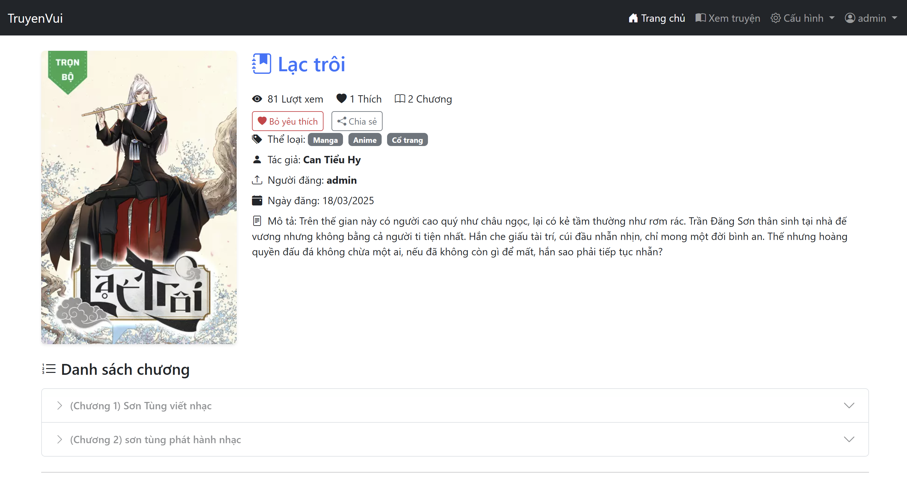
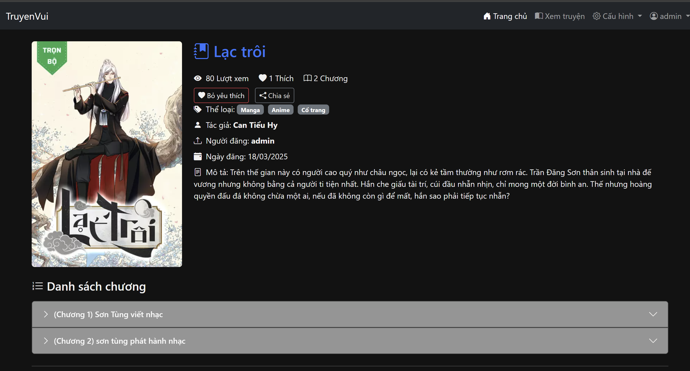

# 📖 TruyenWeb - Website Đọc Truyện Online

Dự án xây dựng website đọc truyện chữ online sử dụng **Django** với giao diện thân thiện, tốc độ cao và có tích hợp **AI kiểm duyệt bình luận** bằng OpenAI.

## 🚀 Tính năng chính

### 👤 Người dùng
- Đăng ký / Đăng nhập / Quên mật khẩu
- Tìm kiếm truyện theo tên, thể loại, tác giả
- Lưu truyện yêu thích, đánh dấu đang đọc
- Chế độ đọc ban đêm (Dark Mode)
- Bình luận dưới chương truyện

### 🛠️ Quản trị viên (Admin)
- Quản lý truyện, chương, thể loại
- Kiểm duyệt / xóa bình luận vi phạm
- Quản lý người dùng, khóa tài khoản

### 🤖 AI Kiểm duyệt bình luận
- Tích hợp **OpenAI Moderation API**
- Tự động phát hiện bình luận vi phạm (spam, toxic...)
- Gửi cảnh báo & ghi log cho quản trị viên

---

## 🖼️ Giao diện demo

| Trang chủ | Đọc truyện | Giao diện ban đêm |
|-----------|------------|--------------------|
|  |  |  |

---

## 🧑‍💻 Công nghệ sử dụng

- **Backend**: Django (Python)
- **Frontend**: HTML, CSS, Bootstrap 5
- **Database**: SQLite (có thể nâng cấp PostgreSQL)
- **Triển khai**: [Render.com](https://render.com)
- **Công cụ**: GitHub, Postman, Django Debug Toolbar, Trello
- **AI kiểm duyệt**: OpenAI Moderation API

---

## 🛠️ Cài đặt & chạy thử

### ⚙️ Yêu cầu:
- Python 3.10+
- pip

### ▶️ Cách chạy local:

```bash
# Clone project
git clone https://github.com/vantu03/truyenweb.git
cd truyenweb

# Tạo môi trường ảo
python -m venv venv
source venv/bin/activate  # (Windows: venv\Scripts\activate)

# Cài đặt thư viện
pip install -r requirements.txt

# Tạo DB và migrate
python manage.py migrate

# Chạy server
python manage.py runserver
